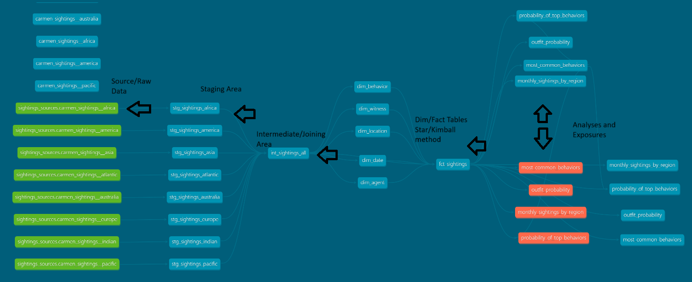

# wheres_carmen?!?!?!? 
## Setup
1. Ensure you have DBT 
```bash
pip install dbt-core dbt-snowflake
```
2. Clone Repo & Navigate to DBT
```bash
git clone https://github.com/HDuCoing/wheres_carmen.git
cd wheres_carmen
```
3. Ensure to set up your profiles.yml in `~/user/.dbt`
```yaml
carmen_dbt:
  target: dev
  outputs:
    dev:
      type: snowflake
      account: <your_account>
      user: <your_username>
      password: <your_password>
      role: <your_role>
      database: <your_database>
      warehouse: <your_warehouse>
      schema: <your_default_schema>
      threads: <number_of_thread>
```
4. Run DBT set up commands
```bash
dbt deps
dbt debug
dbt seed
dbt run
dbt test
dbt docs generate
dbt docs serve
```
## Project Process
1. This project takes in raw data as seeds and creates them into source tables as the starting step.

2. There is a default schema set in Profiles.yml, but each folders has a override schema within the dbt_project. While this isn't always ideal or well-liked that's just what I ended up doing for this.
```yaml
models:
  carmen_dbt:
    staging:
      +schema: staging
      +materialized: view

    mart:
      +schema: mart
      dimensions:
        +materialized: table
      facts:
        +materialized: table

    intermediate:
      +schema: intermediate
      +materialized: view
      
    analysis:
      +schema: analysis
      +materialized: table

seeds:
  +schema: sources
  ```
The staging area will use the source tables as building blocks to put neatly into a relational format in Snowflake.

3. In the interemediate stage there is a table that joins all rows and drops duplicates that aren't needed. This is to avoid 100 trillion rows appearing.

4. The mart stage has dimension and fact tables where different key components of data can easily be separated out. In addition to this, I ensured each column category has a surrogate key to uniquely identify it. This way every row is unique. Like a snowflake!

5. The analysis stage has 3 sections. Adhoc analyses scripts, analysis models for this project, and exposures. These aggregate the data to find informative analytics!

The DAG ends up looking like this:

